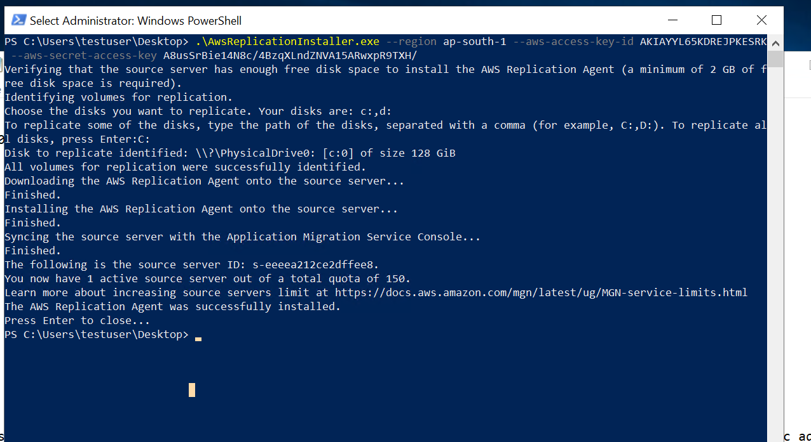

**AWS Application Migration**

Steps to Migrate the Server from On-prem/Azure/GCP to AWS

AWS Application Migration
Create Migrate User and assign the required permissions.

1. Add source server Config on Application migration 
2. download and install agent on source server 
   -- Provide the accesskey and authentication details
   -- select the Disk

   
   -- on Console
   -- application migration 
   -- Select the VM 
   --- Replication 
   -- Edit replicatio and select the configuration 
   -- Subnet/VNET/Size/Disk save the replication

3. start replication
It will start creating a disk, we can launch the VM after completing the replication

4. test server 
stop the replication

5. Cutover 

6. Review and complete the migration. 

